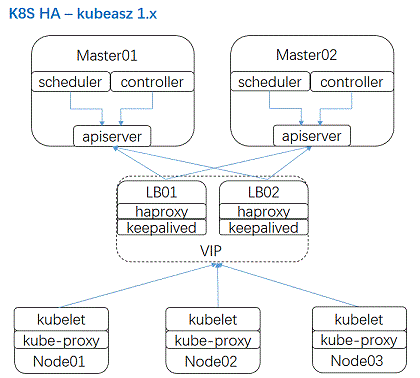

## 00-集群规划和基础参数设定

多节点高可用集群部署步骤与[AllinOne部署](quickStart.md)基本一致，增加LB 负载均衡部署步骤。

### HA architecture



- 注意1：请确保各节点时区设置一致、时间同步。 如果你的环境没有提供NTP 时间同步，推荐集成安装[chrony](../guide/chrony.md)
- 注意2：如果需要在公有云上创建多主多节点集群，请结合阅读[在公有云上部署 kubeasz](kubeasz_on_public_cloud.md)

## 高可用集群所需节点配置如下

|角色|数量|描述|
|:-|:-|:-|
|easzctl节点|1|运行ansible/easzctl脚本，一般复用deploy节点，但如果需要[管理创建多个集群](easzctl_cmd.md#%E5%85%B8%E5%9E%8B-easzctl-%E5%88%9B%E5%BB%BA%E7%AE%A1%E7%90%86%E7%9A%84%E9%9B%86%E7%BE%A4%E6%8B%93%E6%89%91%E5%A6%82%E4%B8%8B)，建议使用独立节点（1c1g）|
|deploy节点|1|运行CA创建、集群部署、插件安装等，一般复用第一个master或node节点|
|etcd节点|3|注意etcd集群需要1,3,5,7...奇数个节点，一般复用master节点|
|master节点|2|多master节点需要额外规划一个master VIP(虚地址)|
|lb节点|2|负载均衡节点安装 haproxy+keepalived，一般复用master节点|
|node节点|3|运行应用负载的节点，可根据需要提升机器配置/增加节点数|

项目预定义了4个例子，请修改后完成适合你的集群规划。

+ [单节点](../../example/hosts.allinone.example)
+ [单主多节点](../../example/hosts.s-master.example)
+ [多主多节点](../../example/hosts.m-masters.example)
+ [在公有云上部署](../../example/hosts.cloud.example)

## 部署步骤

按照[多主多节点](../../example/hosts.m-masters.example)示例的节点配置，准备4台虚机，搭建一个多主高可用集群。

### 1.基础系统配置

+ 推荐内存2G/硬盘30G以上
+ 最小化安装`Ubuntu 16.04 server`或者`CentOS 7 Minimal`
+ 配置基础网络、更新源、SSH登陆等

### 2.在每个节点安装依赖工具

Ubuntu 16.04 请执行以下脚本:

``` bash
# 文档中脚本默认均以root用户执行
apt-get update && apt-get upgrade -y && apt-get dist-upgrade -y
# 安装python2
apt-get install python2.7
# Ubuntu16.04可能需要配置以下软连接
ln -s /usr/bin/python2.7 /usr/bin/python
```
CentOS 7 请执行以下脚本：

``` bash
# 文档中脚本默认均以root用户执行
# 安装 epel 源并更新
yum install epel-release -y
yum update
# 安装python
yum install python -y
```

### 3.在deploy节点安装及准备ansible

- pip 安装 ansible（如果 Ubuntu pip报错，请看[附录](00-planning_and_overall_intro.md#Appendix)）

``` bash
# Ubuntu 16.04 
apt-get install git python-pip -y
# CentOS 7
yum install git python-pip -y
# pip安装ansible(国内如果安装太慢可以直接用pip阿里云加速)
#pip install pip --upgrade
#pip install ansible
pip install pip --upgrade -i http://mirrors.aliyun.com/pypi/simple/ --trusted-host mirrors.aliyun.com
pip install --no-cache-dir ansible -i http://mirrors.aliyun.com/pypi/simple/ --trusted-host mirrors.aliyun.com
```

- 在deploy节点配置免密码登陆

``` bash
# 更安全 Ed25519 算法
ssh-keygen -t ed25519 -N '' -f ~/.ssh/id_ed25519
# 或者传统 RSA 算法
ssh-keygen -t rsa -b 2048 -N '' -f ~/.ssh/id_rsa

ssh-copy-id $IPs #$IPs为所有节点地址包括自身，按照提示输入yes 和root密码
```

### 4.在deploy节点编排k8s安装

- 4.1 下载项目源码

``` bash
# 方式一：使用git clone
git clone --depth=1 https://github.com/easzlab/kubeasz.git /etc/ansible

# 方式二：从发布页面 https://github.com/easzlab/kubeasz/releases 下载源码解压到同样目录
```
- 4.2a 下载二进制文件
请从分享的[百度云链接](https://pan.baidu.com/s/1c4RFaA)，下载解压到/etc/ansible/bin目录，如果你有合适网络环境也可以按照/down/download.sh自行从官网下载各种tar包

``` bash
# 以安装k8s v1.13.5为例
tar -xvf k8s.1-13-5.tar.gz -C /etc/ansible
```
- 4.2b [可选]下载离线docker镜像
服务器使用内部yum源/apt源，但是无法访问公网情况下，请下载离线docker镜像完成集群安装；从百度云盘把`basic_images_kubeasz_x.y.tar.gz` 下载解压到`/etc/ansible/down` 目录

``` bash
tar xvf basic_images_kubeasz_1.0.tar.gz -C /etc/ansible/down
```
- 4.3 配置集群参数
  - 4.3.1 必要配置：`cd /etc/ansible && cp example/hosts.m-masters.example hosts`, 然后实际情况修改此hosts文件
  - 4.3.2 可选配置，初次使用可以不做修改，详见[配置指南](config_guide.md)
  - 4.3.3 验证ansible 安装：`ansible all -m ping` 正常能看到节点返回 SUCCESS

- 4.4 开始安装
如果你对集群安装流程不熟悉，请阅读项目首页 **安装步骤** 讲解后分步安装，并对 **每步都进行验证**  

``` bash
# 分步安装
ansible-playbook 01.prepare.yml
ansible-playbook 02.etcd.yml
ansible-playbook 03.docker.yml
ansible-playbook 04.kube-master.yml
ansible-playbook 05.kube-node.yml
ansible-playbook 06.network.yml
ansible-playbook 07.cluster-addon.yml
# 一步安装
#ansible-playbook 90.setup.yml
```

+ [可选]对集群所有节点进行操作系统层面的安全加固 `ansible-playbook roles/os-harden/os-harden.yml`，详情请参考[os-harden项目](https://github.com/dev-sec/ansible-os-hardening)

## Appendix

- Ubuntu 1604 安装 ansible 如果出现以下错误

``` bash
Traceback (most recent call last):
  File "/usr/bin/pip", line 9, in <module>
    from pip import main
ImportError: cannot import name main
```
将`/usr/bin/pip`做以下修改即可

``` bash
#原代码
from pip import main
if __name__ == '__main__':
    sys.exit(main())

#修改后
from pip import __main__
if __name__ == '__main__':
    sys.exit(__main__._main())
```


[后一篇](01-CA_and_prerequisite.md)
